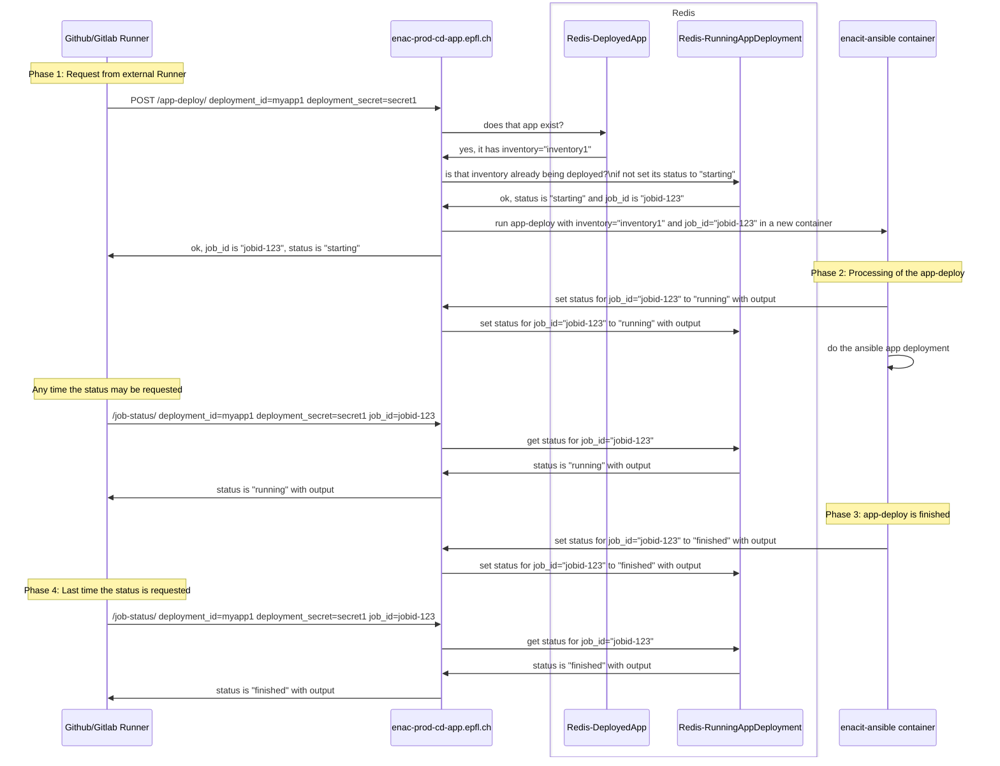
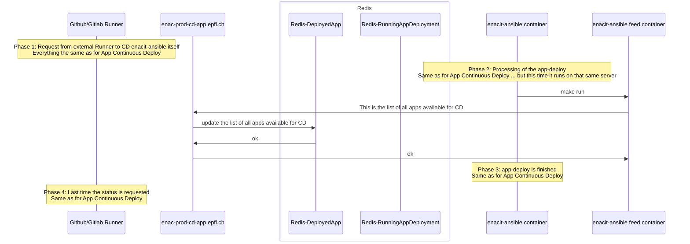

# ENAC Continuous Deployment Application

To see the mermaid diagrams in VSCode, install [bierner.markdown-mermaid](https://marketplace.visualstudio.com/items?itemName=bierner.markdown-mermaid)

## Workflow for an App Continuous Deployment



## Workflow to update Applications list available for CD



# WIP - Work in progress

## Play the app

```bash
make generate-selfsigned-cert

touch .env
cat << EOF > .secret.env
export REDIS_PASSWORD=secret
EOF

make run
```

Browse RedisInsight at http://localhost:8001

Simulate a app-deploy:

```bash
http --verify no POST "https://localhost/set-available-apps/" < sample_inventory.json
# HTTP/1.1 200 OK
# Content-Length: 15
# Content-Type: application/json
# Date: Tue, 02 May 2023 13:57:55 GMT
# Server: uvicorn

# {
#     "status": "ok"
# }


http --verify no POST https://localhost/app-deploy/ deployment_id=app-one deployment_secret=secret123
# # works 1st time
# HTTP/1.1 200 OK
# Content-Length: 71
# Content-Type: application/json
# Date: Tue, 02 May 2023 13:59:23 GMT
# Server: uvicorn

# {
#     "job_id": "01GZEC5GJHFKWMK4Z5A1NM9DPF",
#     "output": "",
#     "status": "starting"
# }

# # fails other times
# HTTP/1.1 200 OK
# Content-Length: 62
# Content-Type: application/json
# Date: Tue, 02 May 2023 13:59:58 GMT
# Server: uvicorn

# {
#     "error": "App deployment is already running",
#     "status": "error"
# }

http --verify no POST https://localhost/job-status/ deployment_id=app-one deployment_secret=secret123 job_id=01GZEC5GJHFKWMK4Z5A1NM9DPF
# HTTP/1.1 200 OK
# Content-Length: 71
# Content-Type: application/json
# Date: Tue, 02 May 2023 14:00:52 GMT
# Server: uvicorn

# {
#     "job_id": "01GZEC5GJHFKWMK4Z5A1NM9DPF",
#     "output": "",
#     "status": "starting"
# }


http --verify no "https://localhost/get-available-apps/"
# HTTP/1.1 200 OK
# Content-Length: 209
# Content-Type: application/json
# Date: Tue, 02 May 2023 14:01:25 GMT
# Server: uvicorn

# {
#     "inventory": [
#         {
#             "deployment_id": "app-one",
#             "deployment_secret": "secret123",
#             "inventory": "app-one.epfl.ch"
#         },
#         {
#             "deployment_id": "app-two",
#             "deployment_secret": "secretABC",
#             "inventory": "app-two.epfl.ch"
#         }
#     ],
#     "status": "ok"
# }
```
