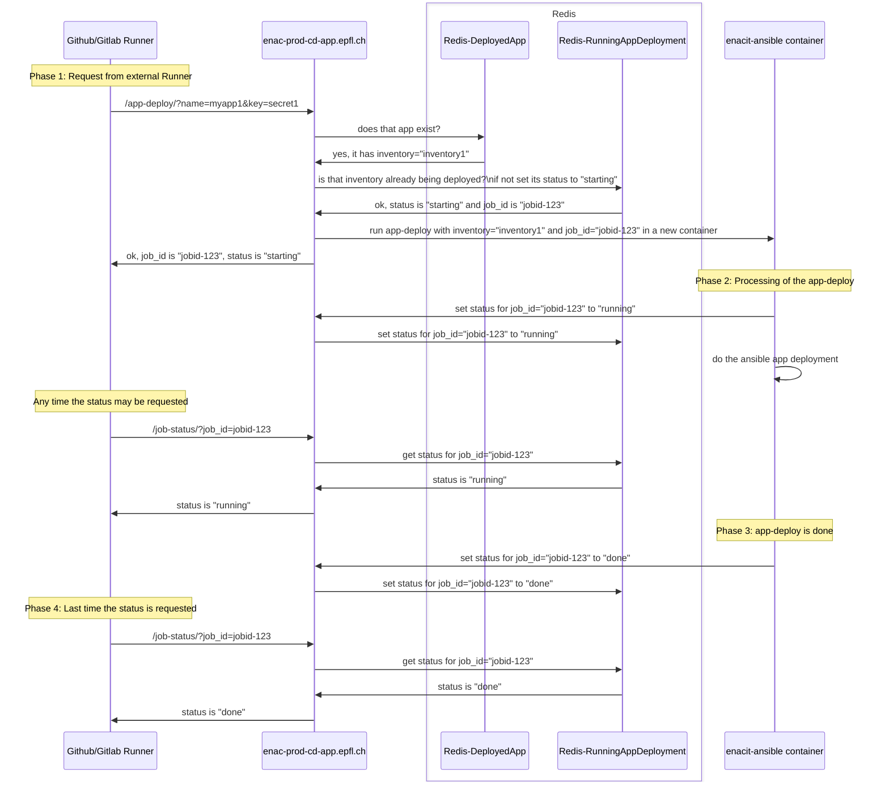
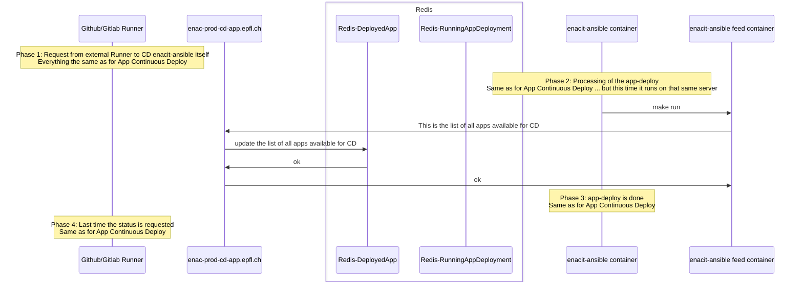

# ENAC Continuous Deployment Application

To see the mermaid diagrams in VSCode, install [bierner.markdown-mermaid](https://marketplace.visualstudio.com/items?itemName=bierner.markdown-mermaid)

## Workflow for an App Continuous Deployment



## Workflow to update Applications list available for CD



# WIP - Work in progress

## Play the app

```bash
make generate-selfsigned-cert
make run
```

Browse RedisInsight at http://localhost:8001

Simulate a app-deploy:

```bash
http --verify no "https://localhost/app-deploy/?name=myapp1&key=secret1"
# # works 1st time
# HTTP/1.1 200 OK
# Content-Length: 84
# Content-Type: application/json
# Date: Thu, 13 Apr 2023 08:22:37 GMT
# Server: uvicorn

# {
#     "job_id": "01GXWVB721DKCAZENADFNKNM4G",
#     "status": "starting"
# }

# # fails other times
# HTTP/1.1 200 OK
# Content-Length: 62
# Content-Type: application/json
# Date: Thu, 13 Apr 2023 08:22:47 GMT
# Server: uvicorn

# {
#     "error": "App deployment is already running",
#     "status": "error"
# }

http --verify no "https://localhost/job-status/?name=myapp1&key=secret1&job_id=01GXWVB721DKCAZENADFNKNM4G"
# HTTP/1.1 200 OK
# Content-Length: 75
# Content-Type: application/json
# Date: Tue, 25 Apr 2023 09:37:08 GMT
# Server: uvicorn

# {
#     "job_id": "01GXWVB721DKCAZENADFNKNM4G",
#     "output": "TODO",
#     "status": "starting"
# }

http --verify no POST "https://localhost/set-available-apps/" < sample_inventory.json
# HTTP/1.1 200 OK
# Content-Length: 15
# Content-Type: application/json
# Date: Tue, 25 Apr 2023 13:16:05 GMT
# Server: uvicorn

# {
#     "status": "ok"
# }

# TODO: removed this debug endpoint
http --verify no "https://localhost/get-available-apps/"
# HTTP/1.1 200 OK
# Content-Length: 177
# Content-Type: application/json
# Date: Tue, 25 Apr 2023 13:16:23 GMT
# Server: uvicorn

# {
#     "inventory": [
#         {
#             "app_name": "app-one",
#             "inventory": "app-one.epfl.ch",
#             "secret": "secret123"
#         },
#         {
#             "app_name": "app-two",
#             "inventory": "app-two.epfl.ch",
#             "secret": "secretABC"
#         }
#     ],
#     "status": "ok"
# }
```

Testing fake status update: (TODO: remove this fake!)

```bash
http --verify no "https://localhost/job-status/?name=myapp1&key=secret1&job_id=01GYWA8F0GMDM5GGNTVPYSWEYK"

# HTTP/1.1 200 OK
# Content-Length: 75
# Content-Type: application/json
# Date: Tue, 25 Apr 2023 13:44:34 GMT
# Server: uvicorn

# {
#     "job_id": "01GYWA8F0GMDM5GGNTVPYSWEYK",
#     "output": "TODO",
#     "status": "starting"
# }

http --verify no "https://localhost/job-status/?name=myapp1&key=secret1&job_id=01GYWA8F0GMDM5GGNTVPYSWEYK"

# HTTP/1.1 200 OK
# Content-Length: 74
# Content-Type: application/json
# Date: Tue, 25 Apr 2023 13:44:35 GMT
# Server: uvicorn

# {
#     "job_id": "01GYWA8F0GMDM5GGNTVPYSWEYK",
#     "output": "TODO",
#     "status": "running"
# }

http --verify no "https://localhost/job-status/?name=myapp1&key=secret1&job_id=01GYWA8F0GMDM5GGNTVPYSWEYK"

# HTTP/1.1 200 OK
# Content-Length: 75
# Content-Type: application/json
# Date: Tue, 25 Apr 2023 13:44:37 GMT
# Server: uvicorn

# {
#     "job_id": "01GYWA8F0GMDM5GGNTVPYSWEYK",
#     "output": "TODO",
#     "status": "finished"
# }

http --verify no "https://localhost/job-status/?name=myapp1&key=secret1&job_id=01GYWA8F0GMDM5GGNTVPYSWEYK"

# HTTP/1.1 200 OK
# Content-Length: 75
# Content-Type: application/json
# Date: Tue, 25 Apr 2023 13:44:38 GMT
# Server: uvicorn

# {
#     "job_id": "01GYWA8F0GMDM5GGNTVPYSWEYK",
#     "output": "TODO",
#     "status": "finished"
# }
```
